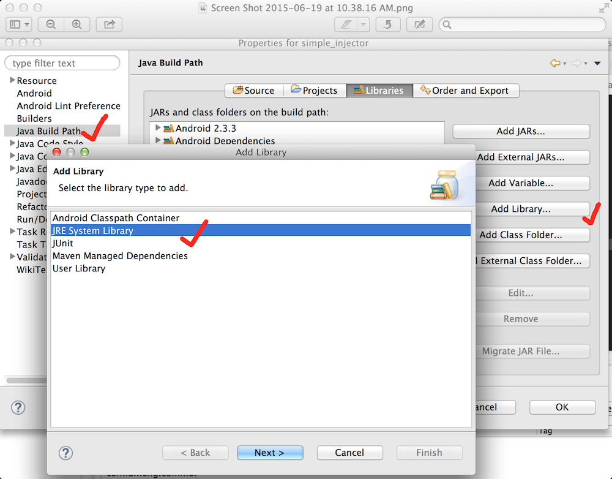

# InjectDagger
使用APT进行注解的库，类似于ButterKnife。目前只完成View id的注解，有兴趣的朋友可以参考一下。

为了使用Annotation Processor Tools,在导入eclipse之后需要添加jre库的引用，步骤如图所示: 

在Java Build Path的Liararies中选择add Library，然后选中JRE库，点击next之后选择finish即可。对于使用Android Studio的同学可以自行搜索如何引用